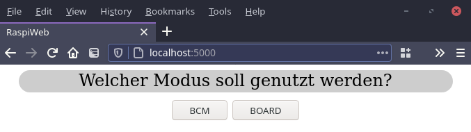
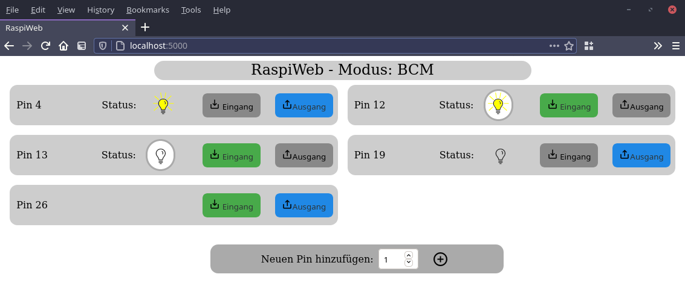

# Raspi-Web
#### *Kontrolliere Deinen Raspberry Pi über das Internet*

Gib dem Benutzer über eine Webseite die Möglichkeit, Ein- und Ausgänge auszulesen und zu verändern.

So können einfach die ersten Schritte zur Arbeit mit dem Raspberry Pi geschaffen werden, 
da der Benutzer sich erstmal nicht um die Programmierung, sondern nur den Aufbau kümmern muss.

# Installation
## Es wird mindestens Python-Version 3.8 benötigt!
Python3.8 kann mit den folgenden Befehlen heruntergeladen und installiert werden.
Dies dauert einen Moment!
```shell script
wget https://www.python.org/ftp/python/3.8.0/Python-3.8.0.tar.xz
tar xf Python-3.8.0.tar.xz
cd Python-3.8.0
./configure --prefix=/usr/local/opt/python-3.8.0
make -j 4
sudo make altinstall
cd ..
sudo rm -r Python-3.8.0
rm Python-3.8.0.tar.xz
echo "export PATH=/usr/local/opt/python-3.8.0/bin:$PATH" >> ~/.bashrc
. ~/.bashrc
```

## Installation der benötigten Module

```shell script
python3.9 -m pip install -r requirements.txt
```
und wenn auf dem Raspberry Pi installiert wird:
```shell script
python3.9 -m pip install RPi.GPIO
```

# Screenshots
Auswahl des Modus:




Beispielnutzung:




# Lizenz
[MIT](LICENSE)